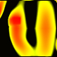



## Awesome Geiss Effects

### Description

The Geiss Effects program is a collection of effects that I wrote to learn to some fluid graphic manipulation. Included is a moving background, the ability to draw text onto the moving fading background (where it will then fade away with everything else), drawing lines on the background, and drawing with your mouse to produce some spectacular effects. Also shows how to do a basic frames per second monitor.
 
### More Info
 
If someone wants to help me port this code to use directx and get some fullscreen effects going, PLEASE email me so we can work on that. arsecannon@yahoo.com

This code runs as 80pixels by 80pixels on my AMD Athlon 750 with 650meg of ram and a Gladiac GeForce(2) DDR... but it is fluid at that size.

             |
---                |---
**Submitted On**   |2000-07-14 15:47:34
**By**             |[Scott Fitzhugh](https://github.com/Planet-Source-Code/PSCIndex/blob/master/ByAuthor/scott-fitzhugh.md)
**Level**          |Intermediate
**User Rating**    |4.6 (37 globes from 8 users)
**Compatibility**  |VB 3\.0, VB 4\.0 \(16\-bit\), VB 4\.0 \(32\-bit\), VB 5\.0, VB 6\.0, VB Script, ASP \(Active Server Pages\) 
**Category**       |[Graphics](https://github.com/Planet-Source-Code/PSCIndex/blob/master/ByCategory/graphics__1-46.md)
**World**          |[Visual Basic](https://github.com/Planet-Source-Code/PSCIndex/blob/master/ByWorld/visual-basic.md)
**Archive File**   |[CODE\_UPLOAD77907142000\.zip](https://github.com/Planet-Source-Code/scott-fitzhugh-awesome-geiss-effects__1-9773/archive/master.zip)

